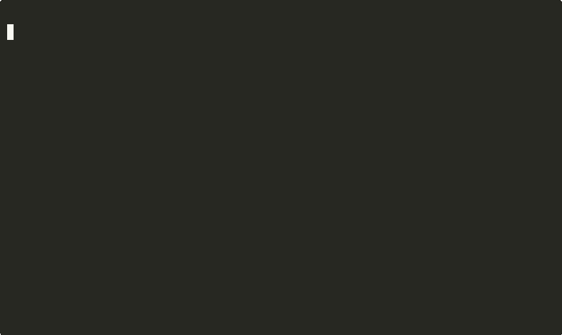

# Algo Scales

An algorithm study tool designed for efficient interview preparation, focusing on common patterns used in technical coding interviews.

## Overview

Algo Scales is a command-line application that helps developers practice and master algorithm patterns for technical interviews. It emphasizes focused learning through curated problems organized by algorithm patterns, offering different learning modes to accommodate various study needs. The application primarily operates in CLI mode.

> **Note**: The Terminal UI mode (`--tui` flag) is currently a work in progress and may not function as expected. Please use the standard CLI mode for a stable experience.

## Features



- **🤖 AI-Powered Assistant**: Get intelligent hints, code reviews, and pattern explanations from Claude or Ollama ([Learn more](AI_ASSISTANT.md))

- **Multiple Learning Modes**:

  - **Learn Mode**: Shows pattern explanations and detailed walkthroughs
  - **Practice Mode**: Hides solutions but allows hints on demand
  - **Cram Mode**: Rapid-fire practice with timers for interview preparation

- **Pattern-Based Learning**: Problems organized by common algorithm patterns (sliding window, two pointers, DFS, etc.)

- **Distraction-Free Environment**: Terminal-based UI keeps you focused on the problem at hand

- **Statistics Tracking**: Records your progress and performance over time

- **Configurable Timer**: Set time limits to simulate interview conditions

- **Multiple Language Support**: Practice in Go, Python, or JavaScript

### 🚧 In Development

- **Neovim Plugin**: Advanced editor integration (in development - see [algo-scales-nvim](https://github.com/lancekrogers/algo-scales-nvim))
- **VS Code Extension**: IDE integration (planned)

## Installation

### Prerequisites

- Go 1.16 or higher
- A terminal editor (vim, nano, etc.) configured through the `EDITOR` environment variable

### Quick Install (Recommended)

**Option 1: One-line installer (no sudo required)**
```bash
curl -fsSL https://raw.githubusercontent.com/lancekrogers/algo-scales/main/install.sh | bash
```

**Option 2: Go install (if you have Go)**
```bash
# Install directly from source (no sudo required)
go install github.com/lancekrogers/algo-scales@latest
```

Both methods install to user directories that are typically already in your PATH:
- `~/go/bin/algo-scales` (Go's default, usually in PATH automatically)
- `~/.local/bin/algo-scales` (standard user bin directory)

### Build from Source

```bash
# Clone the repository
git clone https://github.com/Blockhead-Consulting/algo-scales.git
cd algo-scales

# Option 1: Install to user directory (no sudo required) - RECOMMENDED  
make install-user
# This installs to ~/go/bin or ~/.local/bin (usually already in PATH)

# Option 2: Build and see all installation options
make install

# Option 3: Just build (use with ./bin/algo-scales)
make build
```

The `make install-user` command installs AlgoScales to `~/bin/` without requiring sudo privileges. You'll need to add `~/bin` to your PATH if it's not already there.

### Download Binary

Pre-built binaries are available for the following platforms:

- Linux (x86_64)
- macOS (x86_64, arm64)
- Windows (x86_64)

Download the appropriate binary for your platform from the [releases page](https://github.com/lancekrogers/algo-scales/releases).

## 🎬 See AlgoScales in Action

**Try the full workflow demo** to experience a complete learning session without writing any code:

```bash
# Clone and install
git clone https://github.com/lancekrogers/algo-scales.git
cd algo-scales && make install-user

# Experience the complete workflow (8-12 minutes)
./demo/full-workflow-demo.sh
```

**🎯 This demo shows exactly how AlgoScales works:**
- How problems are displayed and organized by patterns
- Complete problem-solving workflow with realistic user interactions
- AI-powered hints, code review, and personalized guidance
- Progress tracking and daily practice habits
- The unique musical scale approach to algorithm learning

## 🤖 AI-Powered Workflow


AlgoScales integrates AI assistance throughout your learning journey. Here's how it works:

### 1. Start Practice Session
```bash
$ algo-scales start practice sliding-window
✓ Started session: Maximum Sum Subarray
Opening vim with problem layout...
```

### 2. Work in Your Editor with Problem Context
```
┌─ Problem ──────────────────────────┬─ solution.go ────────────────────┐
│ # Maximum Sum Subarray             │ package main                     │
│                                    │                                  │
│ **Difficulty**: Easy               │ func maxSumSubarray(arr []int,   │
│ **Pattern**: sliding-window        │                     k int) int { │
│                                    │     // TODO: Implement           │
│ ## Description                     │                                  │
│ Given an array of positive numbers │     return 0                     │
│ and a positive integer k, find the │ }                                │
│ maximum sum of any contiguous      │                                  │
│ subarray of size k.                │                                  │
├────────────────────────────────────┴──────────────────────────────────┤
│ Tests: 0/4 passed                                                     │
└───────────────────────────────────────────────────────────────────────┘
```

### 3. Get AI-Powered Hints (Progressive Difficulty)
```vim
:AlgoScalesAIHint
```
```
🤖 AI Hint:
Looking at your empty solution, let me guide you:

The sliding window pattern maintains a window of fixed size k
that slides through the array. Start by calculating the sum
of the first k elements, then slide by removing the first
element and adding the next. Track the maximum sum seen.
```

### 4. Interactive AI Chat for Deep Learning
```vim
:AlgoScalesAIChat
```
```
🤖 AI Assistant Ready!
You> What's the time complexity?

Assistant> The time complexity is O(n) where n is the array length.
We visit each element exactly once as the window slides through.
Space complexity is O(1) - only using a few variables.

You> How would this change for variable window size?

Assistant> Great question! For variable window size, you'd use
the expanding/contracting sliding window pattern. Track conditions
to grow or shrink the window dynamically. Common in substring problems.

You> exit
Goodbye! Keep practicing! 👋
```

### 5. Auto-Testing & Immediate Feedback
```
✓ Test 1 passed: [2,1,5,1,3,2], k=3 → 9
✓ Test 2 passed: [1,4,2,10,23,3,1,0,20], k=4 → 39
✓ Test 3 passed: [3,4,5,6,7,2,9,8,1], k=2 → 17
✓ Test 4 passed: Edge case - k=1

🎉 All tests passed!
```

### 6. Track Your Progress
```bash
$ algo-scales stats
📊 Your Progress:
  Patterns mastered: 3/11
  Problems solved: 15
  Current streak: 7 days 🔥
  Favorite pattern: Two Pointers

🎯 Suggested next: Dynamic Programming basics
```

### Other Demos

```bash
# Quick feature overview (2-3 minutes)
./demo/quick-demo.sh

# Detailed feature exploration (15-20 minutes)  
./demo/demo.sh

# Generate GIFs for sharing
./demo/record-demo-gif.sh
```

**Perfect for evaluating AlgoScales before diving into real practice!**

## Usage

### First Run

The first time you run Algo Scales, you'll be asked to enter your license key and email. After validation, the tool will download the problem sets.

```bash
./algo-scales
```

By default, Algo Scales runs in CLI mode.

### AI Assistant Setup (Optional)

Enhance your learning with AI-powered hints and explanations:

```bash
# Configure AI provider (Claude or Ollama)
./algo-scales ai config

# Get intelligent hints while solving problems
./algo-scales hint --ai

# Get AI code review for your solution
./algo-scales review --ai

# Start interactive AI chat
./algo-scales hint --ai --interactive

# Test AI configuration
./algo-scales ai test
```

See the [AI Assistant Guide](AI_ASSISTANT.md) for detailed setup and usage instructions.

### Available Commands

```bash
# Start a session in Learn mode
./algo-scales start learn [problem-id]

# Start a session in Practice mode
./algo-scales start practice [problem-id]

# Start a session in Cram mode (rapid-fire problems)
./algo-scales start cram

# List all available problems
./algo-scales list

# List problems by pattern
./algo-scales list patterns

# List problems by difficulty
./algo-scales list difficulties

# List problems by company
./algo-scales list companies

# View your statistics
./algo-scales stats

# View statistics by pattern
./algo-scales stats patterns

# View your progress trends
./algo-scales stats trends

# Reset your statistics
./algo-scales stats reset
```

### Options

```bash
# Set the programming language (default: go)
./algo-scales start learn --language python

# Set the timer duration in minutes (default: 45)
./algo-scales start practice --timer 30

# Focus on a specific algorithm pattern
./algo-scales start learn --pattern sliding-window

# Select by difficulty
./algo-scales start practice --difficulty medium

# TUI mode (work in progress - not recommended for use)
# ./algo-scales start learn --tui

# Split-screen mode (work in progress - not recommended for use)
# ./algo-scales start practice --split
```

## In-Session Commands

When in a practice session, you can use the following keyboard shortcuts:

- `e`: Open your code in the configured editor
- `h`: Show hints (if available)
- `s`: Show solution (if available)
- `Enter`: Submit your solution
- `n`: Skip to the next problem
- `q` or `Ctrl+C`: Quit the session
- `?`: Show help

## API Server (Optional)

For license validation and problem downloads, you can run the API server:

```bash
cd server
./algo-scales-server
```

The server runs on port 8080 by default, but you can change this with the `PORT` environment variable.

## Licensing

Algo Scales is a commercial product licensed on a per-user basis. Each license is valid for one year from the purchase date.

## Editor Integrations

### Command Line Interface (CLI)
✅ **Fully Functional** - Complete algorithm learning experience in your terminal

### Vim Plugin
✅ **Available** - Seamless integration with Vim/Neovim for in-editor problem solving

#### Installation (Using lazy.nvim)
```lua
{
  'lancekrogers/algo-scales-vim',
  config = function()
    vim.g.algo_scales_path = 'algo-scales'  -- Path to binary
    vim.g.algo_scales_language = 'go'       -- Default language
    vim.g.algo_scales_auto_test = 1         -- Auto-run tests on save
  end,
  cmd = { 'AlgoScalesStart', 'AlgoScalesList', 'AlgoScalesAIHint', 'AlgoScalesAIChat' },
  keys = {
    { '<leader>as', '<cmd>AlgoScalesStart<cr>', desc = 'Start AlgoScales session' },
    { '<leader>al', '<cmd>AlgoScalesList<cr>', desc = 'List problems' },
    { '<leader>aH', '<cmd>AlgoScalesAIHint<cr>', desc = 'Get AI hint' },
    { '<leader>aC', '<cmd>AlgoScalesAIChat<cr>', desc = 'Start AI chat' },
  },
}
```

#### Features
- 🎯 Browse and start problems without leaving vim
- 🤖 AI hints and chat directly in your editor
- ✅ Auto-testing on file save
- 📊 Progress tracking integration
- 🎨 Problem layout with syntax highlighting

### Neovim Plugin
🚧 **In Development** - Advanced editor integration for Neovim users
- Repository: [algo-scales-nvim](https://github.com/lancekrogers/algo-scales-nvim)  
- Status: Core functionality implemented, testing in progress
- Features: Enhanced UI components, floating windows, better Lua integration

### VS Code Extension  
📋 **Planned** - IDE integration for Visual Studio Code users

## Contributing

Contributions are welcome! Please feel free to submit a Pull Request.

## Roadmap

### Current Features
- ✅ AI-powered hints and code reviews (Available now!)
- ✅ Command line interface with full feature set
- ✅ Multiple learning modes (learn, practice, daily)
- ✅ Progress tracking and statistics
- 🚧 Neovim plugin (in development)
- 🚧 Terminal UI with interactive visualizations (In progress)

### Upcoming Features

#### Phase 1: Content & Learning
- More algorithm patterns and problems
- Interactive visualizations for algorithms
- Simulated interview mode with AI interviewers
- Additional AI providers (OpenAI, Google Gemini)
- Pattern-specific AI fine-tuning

#### Phase 2: Cloud Sync & Progress Tracking
- **User Progress Synchronization**
  - Store practice statistics server-side
  - Sync progress across devices
  - Detailed attempt history and time tracking
  - Performance analytics dashboard

#### Phase 3: Community & Gamification
- **Social Learning Features**
  - Anonymous leaderboards by pattern mastery
  - Achievement system with badges
  - Daily coding challenges
  - Competitive practice modes
  - Share progress without revealing solutions

#### Phase 4: Personalized Learning
- **AI-Driven Recommendations**
  - Identify knowledge gaps automatically
  - Personalized problem recommendations
  - Custom learning paths based on goals
  - Interview readiness scoring
  - Weakness-focused practice sessions

#### Phase 5: Teams & Enterprise
- **Organization Features**
  - Team licenses with centralized billing
  - Manager dashboards for progress tracking
  - Custom private problem sets
  - Integration with recruiting platforms
  - Bulk license management

## Credits

Created by Blockhead Consulting

## Support

For support, please email <lance@blockhead.consulting> or open an issue on GitHub.
